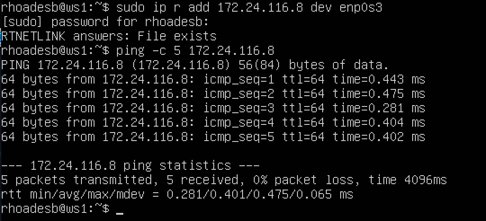
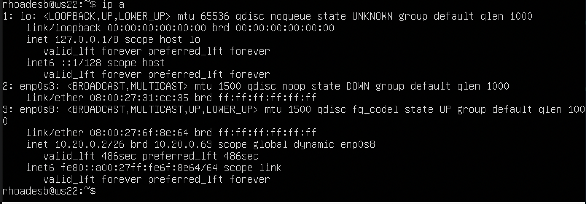

## Part 1. Инструмент **ipcalc**
**== Задание ==**

##### Поднять виртуальную машину (далее -- ws1)

#### 1.1. Сети и маски
##### Определить и записать в отчёт:
##### 1) адрес сети *192.167.38.54/13*
##### 2) перевод маски *255.255.255.0* в префиксную и двоичную запись, */15* в обычную и двоичную, *11111111.11111111.11111111.11110000* в обычную и префиксную
##### 3) минимальный и максимальный хост в сети *12.167.38.4* при масках: */8*, *11111111.11111111.00000000.00000000*, *255.255.254.0* и */4*

#### 1.2. localhost
##### Определить и записать в отчёт, можно ли обратиться к приложению, работающему на localhost, со следующими IP: *194.34.23.100*, *127.0.0.2*, *127.1.0.1*, *128.0.0.1*

#### 1.3. Диапазоны и сегменты сетей
##### Определить и записать в отчёт:
##### 1) какие из перечисленных IP можно использовать в качестве публичного, а какие только в качестве частных: *10.0.0.45*, *134.43.0.2*, *192.168.4.2*, *172.20.250.4*, *172.0.2.1*, *192.172.0.1*, *172.68.0.2*, *172.16.255.255*, *10.10.10.10*, *192.169.168.1*
##### 2) какие из перечисленных IP адресов шлюза возможны у сети *10.10.0.0/18*: *10.0.0.1*, *10.10.0.2*, *10.10.10.10*, *10.10.100.1*, *10.10.1.255*

**== Выполнение задания==**

1.1 Сети и маски

1) Адрес сети *192.167.38.54/13*


Если использовать эту команду с флагом -b, можно скрыть двоичный вывод.


2) Перевод маски *255.255.255.0* в префиксную и двоичную запись


Префиксная запись /24. Двоичная запись - 11111111.11111111.11111111.00000000

_______________________

*/15* в обычную и двоичную


Обычная запись - 255.254.0.0. Двоичная запись 11111111.11111110.00000000.00000000

*11111111.11111111.11111111.11110000* в обычную и префиксную
Эту маску необходимо перевести в бинарный формат, она будет выглядеть следующим образом:
255.255.255.240
Сама маска в двоичном виде имеет 28 последовательных единиц в битовой маске, соответственно, префикс будет /28


3) минимальный и максимальный хост в сети *12.167.38.4* при маске: */8*


HostMin: 12.0.0.1

HostMax: 12.255.255.254

_____________________________________

минимальный и максимальный хост в сети *12.167.38.4* при маске: *11111111.11111111.00000000.00000000*
Эта маска имеет префикс /16


HostMin: 12.167.0.1

HostMax: 12.167.155.254

_____________________________________

минимальный и максимальный хост в сети *12.167.38.4* при маске: *255.255.254.0*
Эта маска в двоичной форме имеет вид 11111111.11111111.11111110.00000000
Эта маска имеет префикс /23


HostMin: 12.167.38.1

HostMax: 12.167.39.254

_____________________________________

минимальный и максимальный хост в сети *12.167.38.4* при маске: */4*


HostMin: 0.0.0.1

HostMax: 15.255.255.254

_____________________________________


1.2 localhost

Для проверки возможности обращения к приложению, работающему на localhost по данным IP-адрессам, необходимо прописать команду *ipcalc <адресс>*. В выводе в строке `Hosts/Net` найти интерфейс Loopback.

194.34.23.100


Интерфейс Loopback отсутствует.

_____________________________________

127.0.0.2


Интерфейс Loopback присутствует

_____________________________________

127.1.0.1 


Интерфейс Loopback присутствует

_____________________________________

128.0.0.1


Интерфейс Loopback отсутствует

_____________________________________

1.3 Диапазоны и сегменты сетей

1) Для проверки публичный или частный IP необходимо прописать ipcalc <address> к каждому ip-шнику. В выводе Hosts/Net отобразится для частных сетей `Private Internet`. Для примера будут приведены в скриншотах две вариации вывода использования данной команды:

10.0.0.45


На данном скрине видно, что 10.0.0.45 является частным IP, а 134.43.0.2 публичным.

Выполнив к каждому IP данную команду, получим:

`-` Публичные IP:

134.43.0.2
172.0.2.1
192.172.0.1
172.68.0.2
192.169.168.1

`-` Частные IP: 

10.0.0.45
192.168.4.2
172.20.250.4
172.16.255.255
10.10.10.10

________________________________________

2) какие из перечисленных IP адресов шлюза возможны у сети 10.10.0.0/18: 10.0.0.1, 10.10.0.2, 10.10.10.10, 10.10.100.1, 10.10.1.255

Для этого необходимо прописать команду `ipcalc -b 10.10.0.0/18`
В выводе терминала находим строки HostMin и HostMax.
Все IP адреса, входящие в данный диапазон, будут возможны в сети 10.10.0.0/18
Подсеть /18 означает, что первые 18 битов адреса зарезервированы для сети, остальные биты могут быть использованы для адресации устройств внутри сети.


HostMin 10.10.0.1
HostMax 10.10.63.255

Соответственно, все IP адреса, входящие в диапазон [10.10.0.1, 10.10.63.255], будут возможны

Входящие в данный диапазон IP адреса: 
10.10.0.2
10.10.10.10
10.10.1.255


## Part 2. Статическая маршрутизация между двумя машинами

**== Задание ==**

##### Поднять две виртуальные машины (далее -- ws1 и ws2)

##### С помощью команды `ip a` посмотреть существующие сетевые интерфейсы
- В отчёт поместить скрин с вызовом и выводом использованной команды.
##### Описать сетевой интерфейс, соответствующий внутренней сети, на обеих машинах и задать следующие адреса и маски: ws1 - *192.168.100.10*, маска */16*, ws2 - *172.24.116.8*, маска */12*
- В отчёт поместить скрины с содержанием изменённого файла *etc/netplan/00-installer-config.yaml* для каждой машины.
##### Выполнить команду `netplan apply` для перезапуска сервиса сети
- В отчёт поместить скрин с вызовом и выводом использованной команды.

#### 2.1. Добавление статического маршрута вручную
##### Добавить статический маршрут от одной машины до другой и обратно при помощи команды вида `ip r add`
##### Пропинговать соединение между машинами
- В отчёт поместить скрин с вызовом и выводом использованных команд.

#### 2.2. Добавление статического маршрута с сохранением
##### Перезапустить машины
##### Добавить статический маршрут от одной машины до другой с помощью файла *etc/netplan/00-installer-config.yaml*
- В отчёт поместить скрин с содержанием изменённого файла *etc/netplan/00-installer-config.yaml*.
##### Пропинговать соединение между машинами
- В отчёт поместить скрин с вызовом и выводом использованной команды.

**== Выполнение ==**

После создания двух вертуальных машин с названиями `ws1` and `ws2`, выполняется команда `ip a`

Созданные виртуальные машины `ws1` and `ws2`


Использование команды `ip a` и её вывод на `ws1` 


Использование команды `ip a` и её вывод на `ws2` 


___________________________

Задаём на обеих машинах адреса и маски через `nano` 

Для ws1


Для ws2


2.1 Добавление статического маршрута вручную

Для успешного выполнения этого этапа, необходимо создать новую внутреннюю сеть в `Oracle VirtualBox` и привязать каждую машину к этой сети (На адаптер 1). Пример на скрине ниже для машины ws1, настройка машины ws2 аналогичная.


____________________________

После правильной настройки сетей машин, можно выполнить этап со следующими командами:  `sudo ip r add <ip_добавляемой машины>` и `ping -c 5 <ip_добавленной машины>`

Для `ws1`



Для `ws2`


2.2 Добавление статического маршрута с сохранением

Для редактирования файла `../../etc/netplan/00-installer-config.yaml` используется редактор `nano` с правами `sudo`

Для `ws1`


Для `ws2`


____________________

Сохранение изменений `netplan'a` и пропинговка адресов машин.

Для `ws1`


Для `ws2`


## Part 3. Утилита **iperf3**

**== Задание ==**

*В данном задании используются виртуальные машины ws1 и ws2 из Части 2*

#### 3.1. Скорость соединения
##### Перевести и записать в отчёт: 8 Mbps в MB/s, 100 MB/s в Kbps, 1 Gbps в Mbps

#### 3.2. Утилита **iperf3**
##### Измерить скорость соединения между ws1 и ws2
- В отчёт поместить скрины с вызовом и выводом использованных команд.

**== Выполнение ==**

#### 3.1. Скорость соединения

Перевод скоростей:

8 Mbps = 1 MB/s

100 MB/s = 819200 Kbps

1 Gbps = 1024 Mbps

#### 3.2. Утилита **iperf3**

ws1 выступает в роли сервера. Запуск iperf3 сервер, команда: iperf3 -s -f m


ws2 выступает в роли клиента. Запуск iperf3 клиент, команда: iperf3 -c 192.168.100.10


## Part 4. Сетевой экран

`-` После соединения машин, перед нами стоит следующая задача: контролировать информацию, проходящую по соединению. Для этого используются сетевые экраны.

**== Задание ==**

#### 4.1. Утилита **iptables**
##### Создать файл */etc/firewall.sh*, имитирующий фаерволл, на ws1 и ws2:
```shell
#!/bin/sh

# Удаление всех правил в таблице "filter" (по-умолчанию).
iptables –F
iptables -X
```
##### Нужно добавить в файл подряд следующие правила:
##### 1) на ws1 применить стратегию когда в начале пишется запрещающее правило, а в конце пишется разрешающее правило (это касается пунктов 4 и 5)
##### 2) на ws2 применить стратегию когда в начале пишется разрешающее правило, а в конце пишется запрещающее правило (это касается пунктов 4 и 5)
##### 3) открыть на машинах доступ для порта 22 (ssh) и порта 80 (http)
##### 4) запретить *echo reply* (машина не должна "пинговаться”, т.е. должна быть блокировка на OUTPUT)
##### 5) разрешить *echo reply* (машина должна "пинговаться")
- В отчёт поместить скрины с содержанием файла */etc/firewall* для каждой машины.
##### Запустить файлы на обеих машинах командами `chmod +x /etc/firewall.sh` и `/etc/firewall.sh`
- В отчёт поместить скрины с запуском обоих файлов.
- В отчёте описать разницу между стратегиями, применёнными в первом и втором файлах.

#### 4.2. Утилита **nmap**
##### Командой **ping** найти машину, которая не "пингуется", после чего утилитой **nmap** показать, что хост машины запущен
*Проверка: в выводе nmap должно быть сказано: `Host is up`*
- В отчёт поместить скрины с вызовом и выводом использованных команд **ping** и **nmap**.

##### Сохранить дампы образов виртуальных машин
**p.s. Ни в коем случае не сохранять дампы в гит!**

**== Выполнение ==**

Создание файлов `firewall.sh` в папке `../../etc/` на машинах `ws1` & `ws2` с помощью текстового редактора `NANO`.

Далее в эти файлы добавляются определенные правила.

Для `ws1`:


Для `ws2`:


______________________

Далее идёт запуск этих фаерволов

ws1:


ws2:


Разница между этими стратегиями состоит в том, что в первом файле первым подходящим правилом для пакета является запрет, а во втором - разрешение. Применяется только первое подходящее правило, остальные игнорируются.

______________________

#### 4.2. Утилита **nmap**

Поиск машины, которая "не пингуется", после этого сразу проверяю утилитой **nmap**

ws1:


ws2:


После выполнения проверки утилитой **nmap** вижу `Host is up`

## Part 5. Статическая маршрутизация сети

**== Задание ==**

##### Поднять пять виртуальных машин (3 рабочие станции (ws11, ws21, ws22) и 2 роутера (r1, r2))

#### 5.1. Настройка адресов машин
##### Настроить конфигурации машин в *etc/netplan/00-installer-config.yaml* согласно сети на рисунке.
- В отчёт поместить скрины с содержанием файла *etc/netplan/00-installer-config.yaml* для каждой машины.
##### Перезапустить сервис сети. Если ошибок нет, то командой `ip -4 a` проверить, что адрес машины задан верно. Также пропинговать ws22 с ws21. Аналогично пропинговать r1 с ws11.
- В отчёт поместить скрины с вызовом и выводом использованных команд.

#### 5.2. Включение переадресации IP-адресов.
##### Для включения переадресации IP, выполните команду на роутерах:
`sysctl -w net.ipv4.ip_forward=1`
*При таком подходе переадресация не будет работать после перезагрузки системы.*
- В отчёт поместить скрин с вызовом и выводом использованной команды.
##### Откройте файл */etc/sysctl.conf* и добавьте в него следующую строку:
`net.ipv4.ip_forward = 1`
*При использовании этого подхода, IP-переадресация включена на постоянной основе.*
- В отчёт поместить скрин с содержанием изменённого файла */etc/sysctl.conf*.

#### 5.3. Установка маршрута по-умолчанию
Пример вывода команды `ip r` после добавления шлюза:
```
default via 10.10.0.1 dev eth0
10.10.0.0/18 dev eth0 proto kernel scope link src 10.10.0.2
```
##### Настроить маршрут по-умолчанию (шлюз) для рабочих станций. Для этого добавить `default` перед IP роутера в файле конфигураций
- В отчёт поместить скрин с содержанием файла *etc/netplan/00-installer-config.yaml*.
##### Вызвать `ip r` и показать, что добавился маршрут в таблицу маршрутизации
- В отчёт поместить скрин с вызовом и выводом использованной команды.
##### Пропинговать с ws11 роутер r2 и показать на r2, что пинг доходит. Для этого использовать команду:
`tcpdump -tn -i eth1`
- В отчёт поместить скрин с вызовом и выводом использованных команд.

#### 5.4. Добавление статических маршрутов
##### Добавить в роутеры r1 и r2 статические маршруты в файле конфигураций. Пример для r1 маршрута в сетку 10.20.0.0/26:
```shell
# Добавить в конец описания сетевого интерфейса eth1:
- to: 10.20.0.0
  via: 10.100.0.12
```
- В отчёт поместить скрины с содержанием изменённого файла *etc/netplan/00-installer-config.yaml* для каждого роутера.
##### Вызвать `ip r` и показать таблицы с маршрутами на обоих роутерах. Пример таблицы на r1:
```
10.100.0.0/16 dev eth1 proto kernel scope link src 10.100.0.11
10.20.0.0/26 via 10.100.0.12 dev eth1
10.10.0.0/18 dev eth0 proto kernel scope link src 10.10.0.1
```
- В отчёт поместить скрин с вызовом и выводом использованной команды.
##### Запустить команды на ws11:
`ip r list 10.10.0.0/[маска сети]` и `ip r list 0.0.0.0/0`
- В отчёт поместить скрин с вызовом и выводом использованных команд.
- В отчёте объяснить, почему для адреса 10.10.0.0/\[маска сети\] был выбран маршрут, отличный от 0.0.0.0/0, хотя он попадает под маршрут по-умолчанию.

#### 5.5. Построение списка маршрутизаторов
Пример вывода утилиты **traceroute** после добавления шлюза:
```
1 10.10.0.1 0 ms 1 ms 0 ms
2 10.100.0.12 1 ms 0 ms 1 ms
3 10.20.0.10 12 ms 1 ms 3 ms
```
##### Запустить на r1 команду дампа:
`tcpdump -tnv -i eth0`
##### При помощи утилиты **traceroute** построить список маршрутизаторов на пути от ws11 до ws21
- В отчёт поместить скрины с вызовом и выводом использованных команд (tcpdump и traceroute).
- В отчёте, опираясь на вывод, полученный из дампа на r1, объяснить принцип работы построения пути при помощи **traceroute**.

#### 5.6. Использование протокола **ICMP** при маршрутизации
##### Запустить на r1 перехват сетевого трафика, проходящего через eth0 с помощью команды:
`tcpdump -n -i eth0 icmp`
##### Пропинговать с ws11 несуществующий IP (например, *10.30.0.111*) с помощью команды:
`ping -c 1 10.30.0.111`
- В отчёт поместить скрин с вызовом и выводом использованных команд.

##### Сохранить дампы образов виртуальных машин
**p.s. Ни в коем случае не сохранять дампы в гит!**

**== Выполнение ==**

Поднимаем 5 новых ВМ с названиями `ws11`, `ws21`, `ws22`, `r1`, `r2`


Настройка файла `00-installer-config.yaml` на каждой машине согласно рисунку

ws11:


ws21:


ws22:


r1:


r2:


______________________________

#### 5.1. Настройка адресов машин

Задав на каждой машине айпи адреса, проверяю верность задания адресов машин командой `ip -4 a` 

ws11:


r1:


ws21:


ws22:


r2:


______________________

#### 5.2. Включение переадресации IP-адресов.

r1:


r2:


__________________

Включение переадресации IP-адресов в файре `/etc/sysctl.conf`

r1:


r2: 


_________________

#### 5.3. Установка маршрута по-умолчанию

Устанавливаем маршрут по умолчанию для машин `ws11`, `ws21`, `ws22`

ws11:


ws21: 


ws22:


Внеся изменения в файлы, принимаем изменения командой `sudo netplan apply`

___________________

Вызываем команду `ip r` и видим добавленный маршрут в таблице маршрутизации (на первой строке)

ws1:


ws21:


ws22:


________________

Если пинговать с `ws11` роутер `r2`, то на экране `ws11` будет показано, что пинг не прошел как на скрине ниже:


Однако пинг прошел, однако у роутера нет данных куда отправлять ответ на пинг. Соответсвтенно, чтобы узнать наверняка, проходит ли пинг, на роутере `r2` прописываем команду `sudo tcmp -tn -i enp0s8`. Она покажет по началу пустоту. Однако если во время выполнения этой команды на машине `ws11` отправить пинг на роутер, на самом роутере появится информация о пинге:


_______________

#### 5.4. Добавление статических маршрутов

В файл `/etc/netplan/00-installet-config.yaml` для роутеров `r1` & `r2` добавляем статические маршруты

r1:


r2: 


Таблицы с маршрутами на обоих роутерах, вызванные с помощью команды `ip r`

r1:


r2:


__________________

Вывод команд `ip r list 10.10.0.0/18` и `ip r list 0.0.0.0/0`


Для адреса 10.10.0.0/18 был выбран маршрут, отличный от 0.0.0.0/0 (он попадает под маршрут по-умолчанию), т.к. машина ws11 соединена с сетью 10.10.0.0/18 по своему IP-адресу 10.10.0.2, для других адресов используется маршрут по умолчанию, который указан в файле 10.10.0.1.

#### 5.5. Построение списка маршрутизаторов

Запустим команду `tcpdump -tnv -i enp0s8` на `r1`


Используем `traceroute 10.20.0.10`, чтобы построить список маршрутов от `ws11` до `ws21`


Каждый пакет проходит на своем пути определенное количество узлов, пока достигнет своей цели. Причем, каждый пакет имеет свое время жизни. Это количество узлов, которые может пройти пакет перед тем, как он будет уничтожен. Этот параметр записывается в заголовке TTL, каждый маршрутизатор, через который будет проходить пакет уменьшает его на единицу. При TTL=0 пакет уничтожается, а отправителю отсылается сообщение Time Exceeded.

Команда traceroute linux использует UDP пакеты. Она отправляет пакет с TTL=1 и смотрит адрес ответившего узла, дальше TTL=2, TTL=3 и так пока не достигнет цели. Каждый раз отправляется по три пакета и для каждого из них измеряется время прохождения. Пакет отправляется на случайный порт, который, скорее всего, не занят. Когда утилита traceroute получает сообщение от целевого узла о том, что порт недоступен трассировка считается завершенной.

_________________

#### 5.6. Использование протокола **ICMP** при маршрутизации

Запускаем команду `sudo tcpdump -n -i enp0s8 icmp` на `r1` для перехвата проходящего трафика по `enp0s3` и одновременно с этим пингуем несуществущий IP с `ws11`

r1:


ws11:


Сохранение дампов машин


___________________

## Part 6. Динамическая настройка IP с помощью **DHCP**

`-` Следующим нашим шагом будет более подробное знакомство со службой **DHCP**, которую ты уже знаешь.

**== Задание ==**

*В данном задании используются виртуальные машины из Части 5*

##### Для r2 настроить в файле */etc/dhcp/dhcpd.conf* конфигурацию службы **DHCP**:
##### 1) указать адрес маршрутизатора по-умолчанию, DNS-сервер и адрес внутренней сети. Пример файла для r2:
```shell
subnet 10.100.0.0 netmask 255.255.0.0 {}

subnet 10.20.0.0 netmask 255.255.255.192
{
    range 10.20.0.2 10.20.0.50;
    option routers 10.20.0.1;
    option domain-name-servers 10.20.0.1;
}
```
##### 2) в файле *resolv.conf* прописать `nameserver 8.8.8.8.`
- В отчёт поместить скрины с содержанием изменённых файлов.
##### Перезагрузить службу **DHCP** командой `systemctl restart isc-dhcp-server`. Машину ws21 перезагрузить при помощи `reboot` и через `ip a` показать, что она получила адрес. Также пропинговать ws22 с ws21.
- В отчёт поместить скрины с вызовом и выводом использованных команд.

##### Указать MAC адрес у ws11, для этого в *etc/netplan/00-installer-config.yaml* надо добавить строки: `macaddress: 10:10:10:10:10:BA`, `dhcp4: true`
- В отчёт поместить скрин с содержанием изменённого файла *etc/netplan/00-installer-config.yaml*.
##### Для r1 настроить аналогично r2, но сделать выдачу адресов с жесткой привязкой к MAC-адресу (ws11). Провести аналогичные тесты
- В отчёте этот пункт описать аналогично настройке для r2.
##### Запросить с ws21 обновление ip адреса
- В отчёте поместить скрины ip до и после обновления.
- В отчёте описать, какими опциями **DHCP** сервера пользовались в данном пункте.

##### Сохранить дампы образов виртуальных машин
**p.s. Ни в коем случае не сохранять дампы в гит!**

**== Выполнение ==**

Устанавливаем утилиту `isc-dhcp-server`

Далее настраиваем конфигурацию `dhcp` в файле `/etc/dhcp/dhcpd.conf`


Далее настраиваем конфигурацию в файле `/etc/resolv.conf`


Командой `systemctl restart isc-dhcp-server` перезагружаем службу DHCP


__________________

Необходимо изменить настройки машин `ws21` и ws22` в файле `/etc/netplan/00-installer-config.yaml`, чтобы активировать протокол DHCP

ws21:


ws22:


Перезагружаем `ws21` командой `sudo reboot` и проверяем присвоенные адреса командой `ip a`

ws21:


ws22:



Проверяем соединение машин через пинг


0 пакетов потеряно

________________________

Добавление строки мак-адреса `ws11` в файле `/etc/netplan/00-installer-config.yaml`


После редактирования файла, нужно выключить машину и зайти в настройки сети в VirtualBox


Далее надо настроить `r1` аналогично `r2`, но с жёсткой привязкой к мак адерсу `ws11`


________________

Далее настройка файла `/etc/resolv.conf` и рестарт DHCP 


Проверка адреса на `ws11`


Как видно, адрес выдан машине. Пропингуем соединение


____________________

IP `ws21`  до обновления 


Запрос обновления


IP после обновления


После обновления IP `ws21` изменился на 10.20.0.4

__________________

Выполним команды для удаления старого IP адреса `sudo dhclient -r`, `sudo dhclient -r eth0` , `sudo dhclient eth0` и проверим ip


В задании 6 были использованы следующие опции DHCP протокола:

option routers ip-address [, ip-address...]; - адреса шлюзов для клиентской сети. Маршрутизаторы должны быть перечислены в порядке предпочтительности.
option domain-name-servers ip-address [, ip-address...]; - Список DNS серверов доступных клиенту. Сервера должны быть перечислены в порядке предпочтительности.

________________________

Сохранение дампов


## Part 7. **NAT**

**== Задание ==**

*В данном задании используются виртуальные машины из Части 5*
##### В файле */etc/apache2/ports.conf* на ws22 и r1 изменить строку `Listen 80` на `Listen 0.0.0.0:80`, то есть сделать сервер Apache2 общедоступным
- В отчёт поместить скрин с содержанием изменённого файла.
##### Запустить веб-сервер Apache командой `service apache2 start` на ws22 и r1
- В отчёт поместить скрины с вызовом и выводом использованной команды.
##### Добавить в фаервол, созданный по аналогии с фаерволом из Части 4, на r2 следующие правила:
##### 1) удаление правил в таблице filter - `iptables -F`
##### 2) удаление правил в таблице "NAT" - `iptables -F -t nat`
##### 3) отбрасывать все маршрутизируемые пакеты - `iptables --policy FORWARD DROP`
##### Запускать файл также, как в Части 4
##### Проверить соединение между ws22 и r1 командой `ping`
*При запуске файла с этими правилами, ws22 не должна "пинговаться" с r1*
- В отчёт поместить скрины с вызовом и выводом использованной команды.
##### Добавить в файл ещё одно правило:
##### 4) разрешить маршрутизацию всех пакетов протокола **ICMP**
##### Запускать файл также, как в Части 4
##### Проверить соединение между ws22 и r1 командой `ping`
*При запуске файла с этими правилами, ws22 должна "пинговаться" с r1*
- В отчёт поместить скрины с вызовом и выводом использованной команды.
##### Добавить в файл ещё два правила:
##### 5) включить **SNAT**, а именно маскирование всех локальных ip из локальной сети, находящейся за r2 (по обозначениям из Части 5 - сеть 10.20.0.0)
*Совет: стоит подумать о маршрутизации внутренних пакетов, а также внешних пакетов с установленным соединением*
##### 6) включить **DNAT** на 8080 порт машины r2 и добавить к веб-серверу Apache, запущенному на ws22, доступ извне сети
*Совет: стоит учесть, что при попытке подключения возникнет новое tcp-соединение, предназначенное ws22 и 80 порту*
- В отчёт поместить скрин с содержанием изменённого файла.
##### Запускать файл также, как в Части 4
*Перед тестированием рекомендуется отключить сетевой интерфейс **NAT** (его наличие можно проверить командой `ip a`) в VirtualBox, если он включен*
##### Проверить соединение по TCP для **SNAT**, для этого с ws22 подключиться к серверу Apache на r1 командой:
`telnet [адрес] [порт]`
##### Проверить соединение по TCP для **DNAT**, для этого с r1 подключиться к серверу Apache на ws22 командой `telnet` (обращаться по адресу r2 и порту 8080)
- В отчёт поместить скрины с вызовом и выводом использованных команд.

**== Выполнение ==**

Устанавливаем утилиту `apache2` на машины `r1`, `r2`, `ws22`

На `ws22` и `r2` в файле `/etc/apache2/ports.conf` меняем строку `Listen 80` на `Listen 0.0.0.0:80`

ws22:


r1:


___________________

Запускаем Веб-сервер командой `ws22` and `r1`

ws22:


r1:


_______________
_______________

Создание фаервола как в 4й части.

r2:


Запуск фаервола:


С этим фаерволом машины `r1` and `ws22` не должны пинговаться друг с другом


Разрешить маршрутизацию всех пакетов протокола ICMP, для этого прописываем правило для протокола icmp и цепочки FORWARD

В файле `/etc/firewall.sh/` прописать дополнительную строчку с разрешением и перезапустить фаервол


C таким правилом машины должны иметь соединение


_____________________

В файл `/etc/firewall.sh` добавляем 2 новых правила с включением `SNAT` и `DNAT`


Значения использованных опций:

`t` - указывает на используемую таблицу;
`p` - указывает протокол, такие как tcp, udp, udplite и другие, поддерживаемые системой, ознакомиться со списком можно в файле /etc/protocols;
`m` - подключает указанный модуль;
`s` - указывает адрес источника пакета, в качестве значения можно указать как один IP-адрес, так и диапазон;
`i` - задает входящий сетевой интерфейс;
`o` - указывает исходящий сетевой интерфейс;
`--dport` - порт получателя пакета;
`DNAT` — подменяет адрес получателя в заголовке IP-пакета, основное применение — предоставление доступа к сервисам снаружи, находящимся внутри сети;
`SNAT` — служит для преобразования сетевых адресов, применимо, когда за сервером находятся машины, которым необходимо предоставить доступ в Интернет, при этом от провайдера имеется статический IP-адрес.

Запуск фаервола с двумя новыми правилами как в 4м пункте


_____________________

Проверяем соединение по TCP для SNAT командой `telnet 10.100.0.11 80` на `ws22` (подключение к серверу Apache `r1`)


___________________

Подмену IP-адреса можно увидеть с помощью команды  `tcpdump -i enp0s9`, пингуя с  `ws22` роутер `r1`.


__________________

Проверяем соединение по ТСР для DNAT командой `telnet 10.100.0.12 8080` на `r1` (подключение к серверу Apache `ws22` через адрес `r2` и порт 8080)


## Part 8. Дополнительно. Знакомство с **SSH Tunnels**

**== Задание ==**

*В данном задании используются виртуальные машины из Части 5*

##### Запустить на r2 фаервол с правилами из Части 7
##### Запустить веб-сервер **Apache** на ws22 только на localhost (то есть в файле */etc/apache2/ports.conf* изменить строку `Listen 80` на `Listen localhost:80`)
##### Воспользоваться *Local TCP forwarding* с ws21 до ws22, чтобы получить доступ к веб-серверу на ws22 с ws21
##### Воспользоваться *Remote TCP forwarding* c ws11 до ws22, чтобы получить доступ к веб-серверу на ws22 с ws11
##### Для проверки, сработало ли подключение в обоих предыдущих пунктах, перейдите во второй терминал (например, клавишами Alt + F2) и выполните команду:
`telnet 127.0.0.1 [локальный порт]`
- В отчёте описать команды, необходимые для выполнения этих четырёх пунктов, а также приложить скриншоты с их вызовом и выводом.

##### Сохранить дампы образов виртуальных машин
**p.s. Ни в коем случае не сохранять дампы в гит!**

**== Выполнение ==**

Возвращаем состояние машин к выполненому пятому заданию через снимки машин

Далее устанавливаем поновой утилиту `apache2`

В файле `/etc/apache2/ports.conf` вместо `Listen 80` необходимо прописать `Listen localhost:80`


1) Воспользуемся `Local TCP forwarding` с `ws21` до `ws22`, чтобы получить доступ к веб-серверу на `ws22` с `ws21`

Перенаправление локального порта позволяет переслать трафик с порта на вашем локальном компьютере (клиент SSH) на порт на удаленном компьютере (сервер SSH), который, в свою очередь, направляется на порт на целевом компьютере. В данном случае клиент SSH ожидает подключений на определенном порту и пересылает любые соединения, поступающие на этот порт, на указанный порт на удаленном сервере SSH, который затем устанавливает связь с портом на целевом компьютере. Этот целевой компьютер может быть как удаленным SSH-сервером, так и любым другим компьютером.
Давайте опишем процесс перенаправления порта с сервера по шагам:

На машине `ws22` устанавливаем соединение с машиной `ws21`, на котором запущен SSH-сервер.
На машине `ws22` выполняем команду `ssh -L`, чтобы настроить прямое соединение с машины `ws21` через машину `ws22`.

Для контроля процессов соединей на запущенной машине с сервером `apache2`, проверим процессы с именем `sshd` с помощью команды `ps aux | grep sshd`

Здесь все процессы `sshd` которые запущены до момента создания ssh-туннеля на машине `ws22`


Создаём соединение. Запускаем на машине `ws22` команду `ssh 10.20.0.20`


Оставаясь на машине `ws22`, устанавливаем соединение с сервером `ws22` от машины `ws21` командой `ssh -L 8080:127.0.0.1:80 10.20.0.20`


Проверяем процессы на машине `ws22` после создания соединения командой `ps aux | grep sshd`


На машине ws21 запускаем утилиту `telnet` командой `telnet 127.0.0.1 8080`


Проверяем запущенные процессы на машине `ws21` и "убиваем" процесс отвечающий за соединение с сервером командой `ps aux | grep sshd`


Когда процесс, на машине `ws21`, отвечающий за соединение, будет "убит", появится сообщение на машине `ws22`


2) Для получения доступа к веб-серверу на компьютере ws22 с компьютера ws11, мы можем воспользоваться удаленным перенаправлением TCP.

Переадресация удаленного порта представляет собой противоположную операцию по сравнению с переадресацией локального порта. В этом случае мы настраиваем перенаправление порта на удаленном компьютере (который является сервером SSH) на порт локального компьютера (который является клиентом SSH). Затем все соединения, направленные на этот удаленный порт, пересылаются на указанный порт на локальной машине клиента SSH. После этого клиент SSH устанавливает соединение с портом на целевом компьютере. Целевой компьютер может быть как локальным, так и любым другим компьютером. Удаленное перенаправление портов обычно используется для предоставления доступа к внутренним службам снаружи.

Из-за того что на роутере `r2` настроен `firewall`, подключиться к серверу Apache на машине `ws22` с помощью команды ssh -L, с машины `ws11`, не получится (роутер `r2` не пропустит команду). В этом случае необходимо воспользоваться командой ssh -R. Выполнить её необходимо на машине `ws22`. Это выполняется за несколько шагов:

На машине `ws11`: переход с машины `ws11` на роутер `r2` с помощью `ssh` (роутер не позволит сразу перейти на машину `ws22`);
На машине `ws11`: переход с роутера r2 на машину `ws22` с помощью `ssh`;
На машине `ws11`: проброс туннеля с машины `ws22` на машину `ws11` с помощью `ssh -R`;
Описание команды:

`ssh -R [удаленный_адрес:]удаленный_порт:локальный_адрес:локальный_порт [пользователь@]сервер`

Пробрасываем маршрут. Запускаем с машины `ws11` команду `ssh 10.100.0.12`

Благодаря этой команде находясь на машине `ws11` можно увидить следующую картину, в которой изменится хост текущей машины на `r2`


Далее находясь физически на той же машине `ws11` с именем хоста `r2`, вводим следующую команду `ssh 10.20.0.20`

Находясь на машине `ws11`, получим следующий результат `r2` -> `ws22`


В предыдущей части на роутере `r2` был настроен на `fireWall`, который не пропускает проходящие пакеты из другой сети. Поэтому сначала необходимо пробросить тунель от `ws22` к `ws11`. Для этого запускаем на машине `ws11`команду `ssh -R 10.10.0.2:8080:127.0.0.1:80 10.10.0.2`


Для проверки, сработало ли подключение, переходим во второй терминал (для этого находясь в терминале машины `ws11` нажимаем `option + fn + F2` или Alt + F2) и выполяем команду (`telnet 127.0.0.1 [локальный порт]`). В момент выполнения данной команды необходимо нажать любую клавишу `telnet 127.0.0.1 8080`


Сохраняем дампы образов машин


